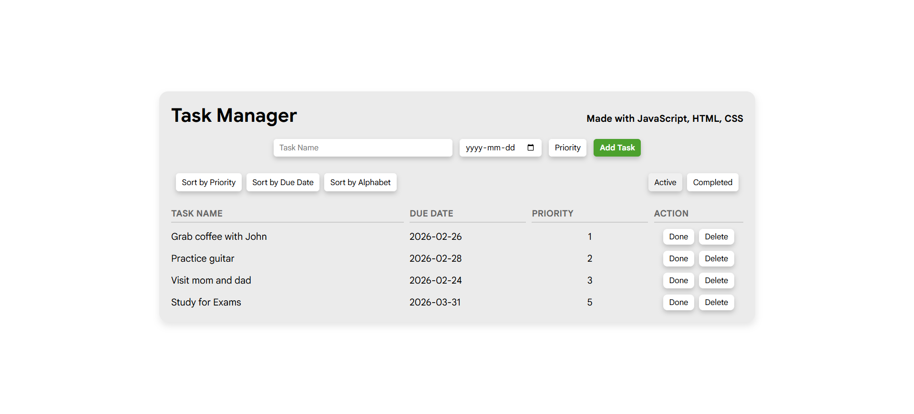

# Task-Manager

Task manager app created using HTML, CSS, and JavsScript.

## Development
I consider this my first "real" HTML, CSS, and JavaScript project.
Took about a month of on-and-off progress and learning during school, completed this prooject over my reading week.

Was inspired by https://github.com/NisreenSalameh/tasksmanager

Why my codes better:
- **NOT DOM-centric:** Tasks are stored as an array of obj's in JavaScript
- **Task Database:** Used constructor as a task creation template, stored in an allTasks array
- **Task ID:** Tasks are assigned an ID based on date and random
- **Dynamic HTML** I use template literals in my JavaScript to redraw the task table

## Features

- **Add Tasks:** Add new tasks with a name, due date, and priority level.
- **Complete Tasks:** Mark tasks as complete to remove from active tasks.
- **Delete Tasks:** Delete tasks that are no longer needed.
- **Priority and Due Date Tracking:** Set task priorities by level (1-5) and due dates for better task management.
- **Sorting and Filtering:** Sort tasks by priority or due date and filter tasks by status (Active Tasks, Completed Tasks).

